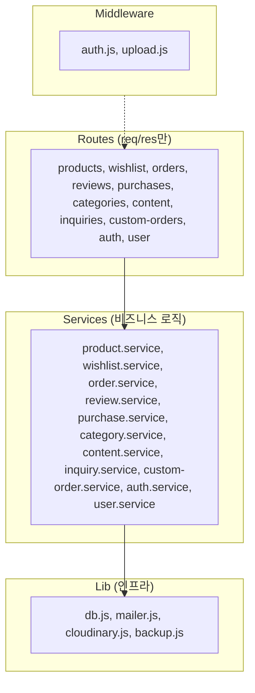

# Application Design — CROCINI (서비스 레이어 전체 도입)

## Target Architecture (3계층)

```
Routes (HTTP) → Services (비즈니스 로직) → Lib (인프라)
```



## Target Directory Structure

```
backend/
├── server.js
├── db.js
├── migrate.js
├── routes/
│   ├── products.js
│   ├── wishlist.js
│   ├── orders.js
│   ├── reviews.js
│   ├── purchases.js
│   ├── categories.js
│   ├── content.js
│   ├── inquiries.js
│   ├── custom-orders.js
│   ├── auth.js
│   └── user.js
├── services/
│   ├── product.service.js
│   ├── wishlist.service.js
│   ├── order.service.js
│   ├── review.service.js
│   ├── purchase.service.js
│   ├── category.service.js
│   ├── content.service.js
│   ├── inquiry.service.js
│   ├── custom-order.service.js
│   ├── auth.service.js
│   └── user.service.js
├── middleware/
│   ├── auth.js          ← requireUser, requireAdmin 통합
│   └── upload.js
├── lib/
│   ├── cloudinary.js
│   ├── mailer.js
│   └── backup.js
└── tests/
    ├── services/
    │   ├── wishlist.service.test.js
    │   ├── content.service.test.js
    │   ├── product.service.test.js
    │   └── ...
    └── setup.js
```

## 레이어별 책임

| Layer | 책임 | 예시 |
|-------|------|------|
| Route | req 파싱, 입력 검증, 서비스 호출, res 응답 | `const items = await wishlistService.list(userId); res.json(items);` |
| Service | 비즈니스 로직, DB 쿼리, 외부 서비스 호출 | `async list(userId) { return pool.query(...) }` |
| Lib | 인프라 연결 (DB pool, 메일 전송, 이미지 업로드) | `pool.query()`, `transporter.sendMail()` |
| Middleware | 횡단 관심사 (인증, 파일 업로드) | `requireUser(req, res, next)` |

## 순환 참조 방지 규칙
- Routes → Services → Lib (단방향만 허용)
- Services 간 상호 호출 금지 (필요 시 Lib로 공통 추출)
- Middleware는 Routes에만 주입

## 리팩토링 순서 (간단한 것부터)

| 순서 | 모듈 | 복잡도 | 이유 |
|------|------|--------|------|
| 1 | wishlist | ★☆☆ | 4개 엔드포인트, 단순 CRUD |
| 2 | content | ★☆☆ | 2개 엔드포인트, 가장 단순 |
| 3 | categories | ★★☆ | CRUD + 보호 로직 |
| 4 | reviews | ★★☆ | 구매 확인 검증 포함 |
| 5 | purchases | ★★☆ | 관리자 + 자동 등록 |
| 6 | inquiries | ★★☆ | 이메일 알림 포함 |
| 7 | custom-orders | ★★☆ | 이메일 알림 + 옵션 파싱 |
| 8 | products | ★★★ | 이미지 업로드/삭제, 상세이미지 |
| 9 | auth | ★★★ | 세션, bcrypt, rate-limit |
| 10 | orders | ★★★ | 토스페이먼츠 결제, 환불 |
| 11 | user | ★☆☆ | 조회만 (마지막에 간단히) |
